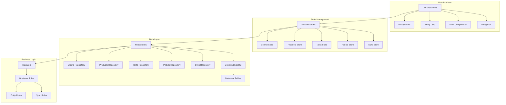
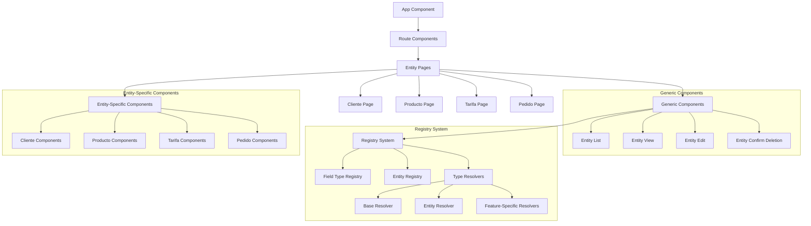
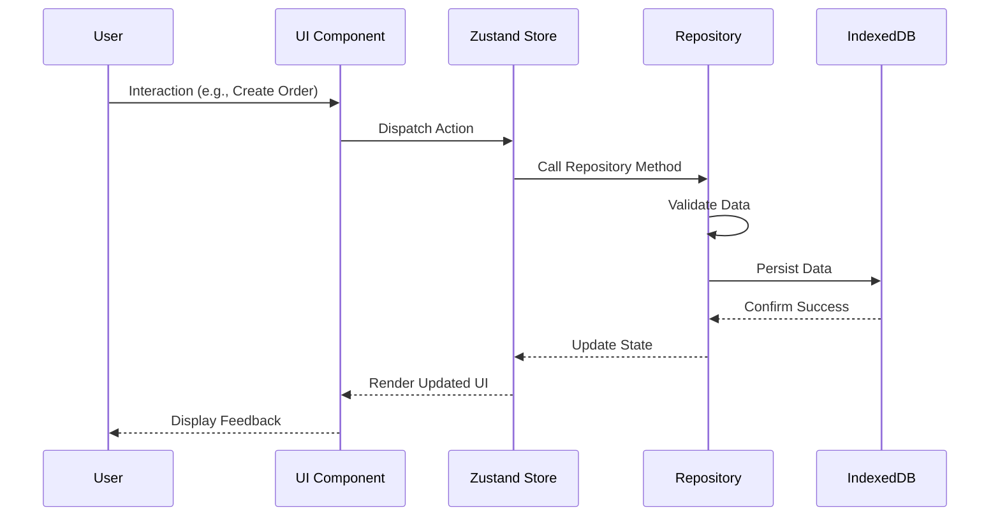
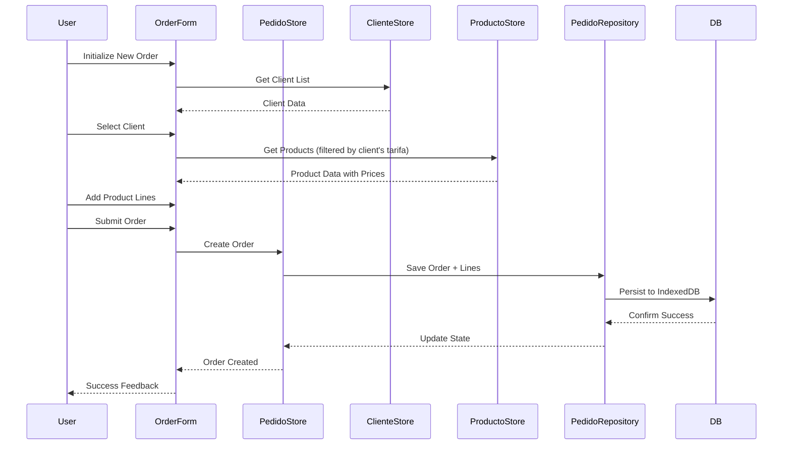
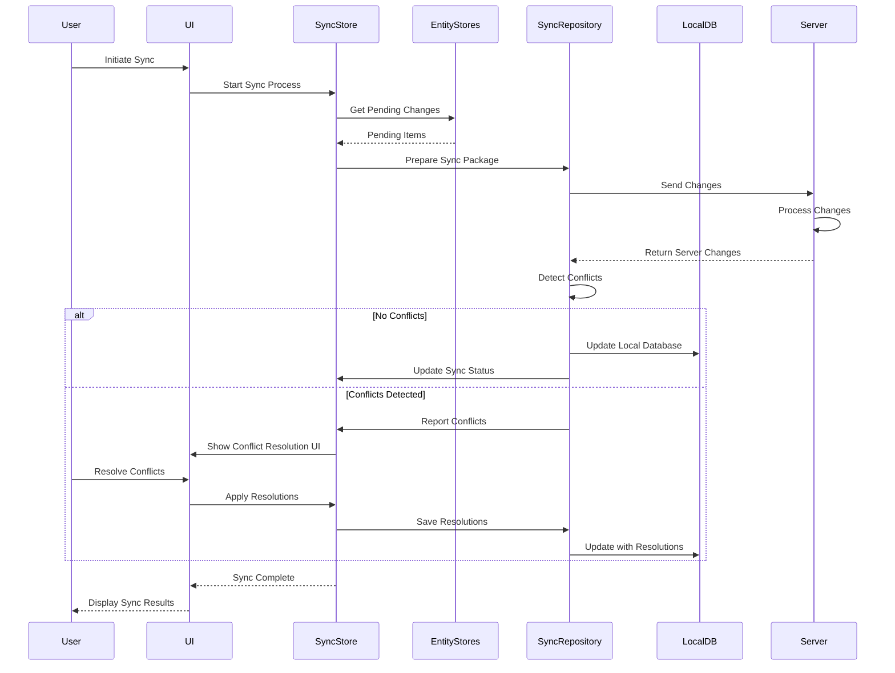
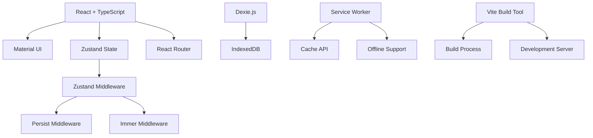

# Preventa Application Architecture

## Overview

This document provides a comprehensive view of the Preventa application's architecture, including component relationships, data flow, and key workflows.

## Architecture Diagram

## Component Structure

## Data Flow

## Key Workflows

### Order Creation Workflow

### Synchronization Workflow

## Technology Stack Integration

## Performance Considerations

### Client-Side Rendering
- Components use React.memo for memoization when appropriate
- Lists implement virtualization for handling large datasets
- Heavy operations are performed in web workers when possible

### Data Management
- IndexedDB queries use efficient indexing strategies
- State updates are batched when possible
- Large datasets are paginated with infinite scrolling

### Offline Support
- Critical assets are precached during installation
- Background sync is used for data synchronization
- Optimistic UI updates provide immediate feedback

## Scalability Considerations

### Data Volume
- Application is designed to handle:
  - Up to 10,000 products
  - Up to 5,000 customers
  - Up to a total of 50,000 orders
  - Up to 200,000 order lines

### Performance Targets
- Initial load time: Under 2 seconds on average connections
- Time to interactive: Under 3 seconds
- List rendering: Under 500ms for 1,000 items
- Form submission: Under 300ms processing time

## Security Considerations

### Data Storage
- Sensitive data is not stored in localStorage
- IndexedDB data is encrypted when containing sensitive information

### Authentication
- Token-based authentication with secure storage
- Automatic token refresh mechanism
- Session timeout handling

### API Communication
- All API requests use HTTPS
- CSRF protection implemented
- Rate limiting applied to prevent abuse
