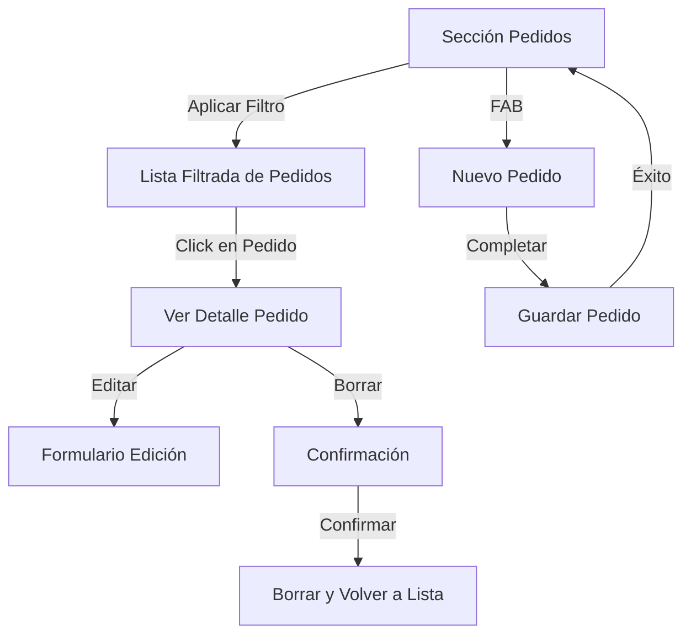
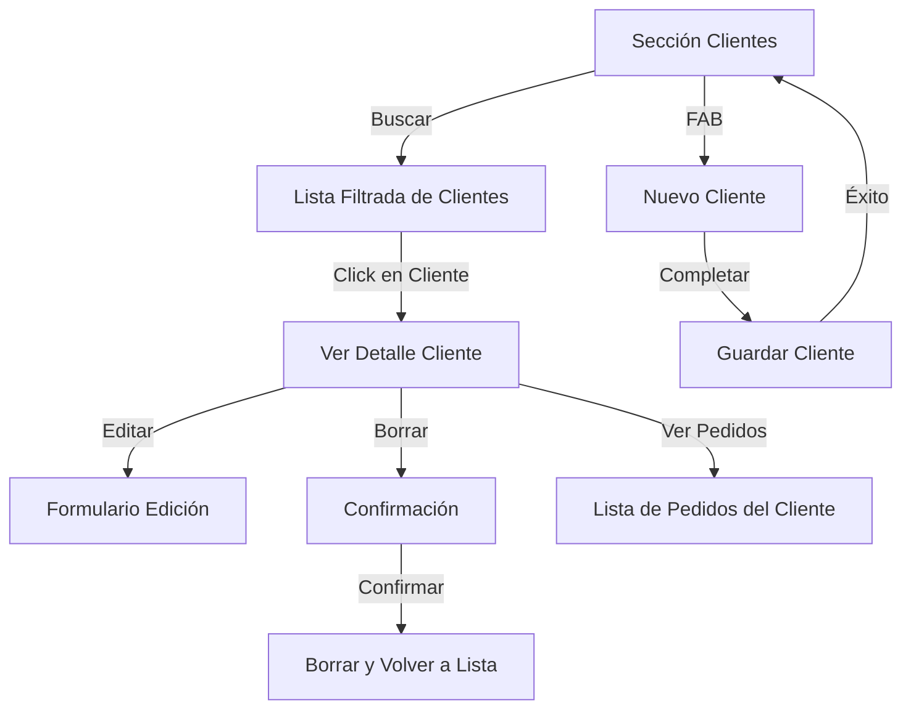
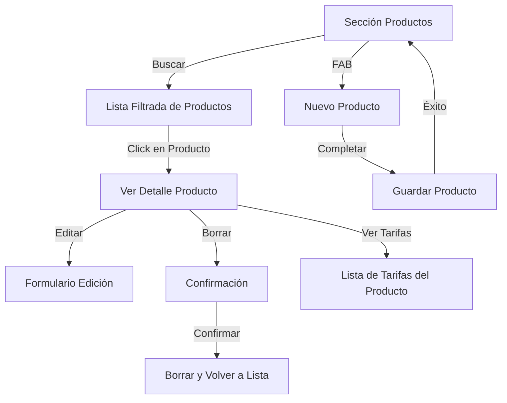
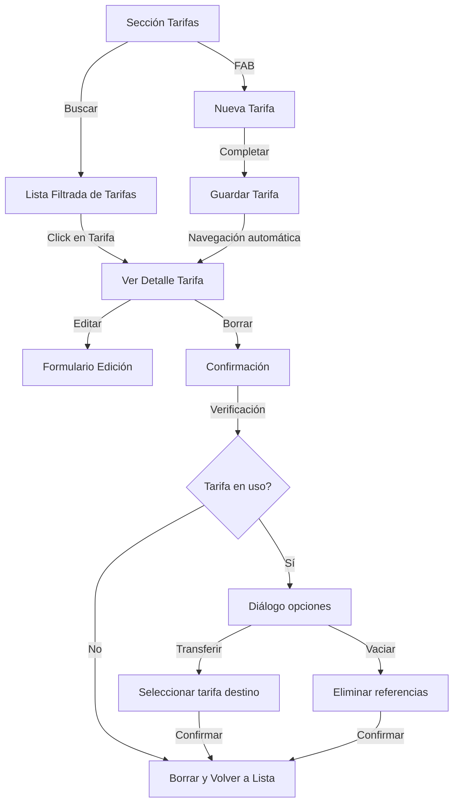
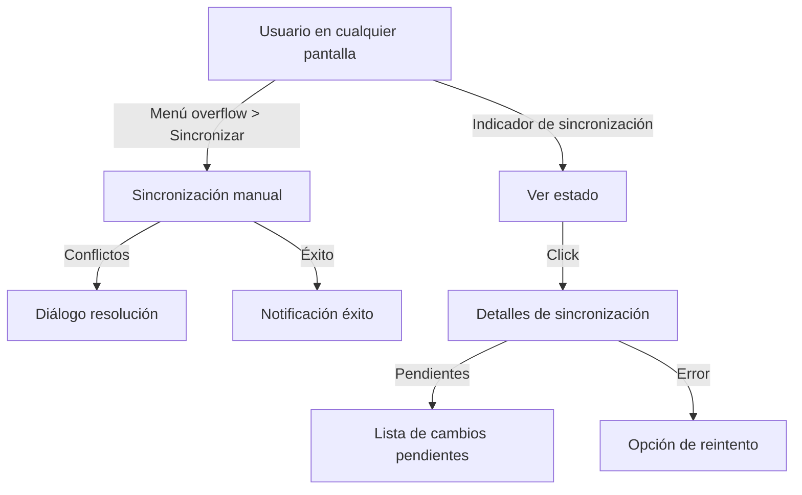
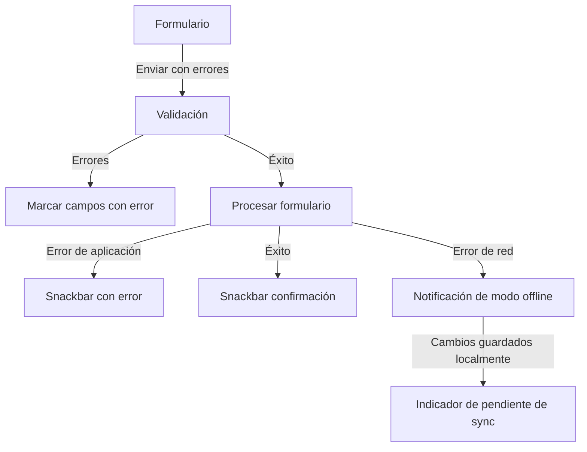

# Flujos de Navegación e Interacción

Este documento define los flujos de navegación y la interacción entre pantallas de la aplicación preventa-app, proporcionando un mapa claro para implementar la experiencia de usuario completa.

## Estructura de Navegación Principal

```
┌─────────────────────────────────────────────────┐
│                  Barra Superior                  │
│ (Indicador de sincronización, título de sección) │
└─────────────────────────────────────────────────┘
                        │
                        ▼
┌─────────────────────────────────────────────────┐
│                  Área Principal                  │
│           (Contenido de cada sección)            │
└─────────────────────────────────────────────────┘
                        │
                        ▼
┌─────────────────────────────────────────────────┐
│                Navegación Inferior               │
│     Pedidos │ Clientes │ Productos │ Tarifas    │
└─────────────────────────────────────────────────┘
```

## Menú y Navegación

- **Navegación inferior**: Barra de pestañas con iconos y texto para las 4 secciones principales
- **FAB (Floating Action Button)**: Presente en todas las secciones, contextual según la sección actual
- **Menú overflow**: Accesible desde la barra superior, con opciones como:
  - Sincronizar datos
  - Generar datos demo
  - Limpiar datos
  - Acerca de

## Flujos de Usuario Principales

### 1. Flujo de Pedidos



#### Interacciones Detalladas - Pedidos

1. **Lista de Pedidos**
   - Inicialmente vacía con mensaje "Aplique filtros para ver pedidos"
   - Filtros disponibles encima de la lista (contraíbles/expandibles) (Ver pedidos-filtering.md)
   - Cada pedido muestra: cliente, fecha, total, indicador de sincronización
   - FAB para crear nuevo pedido

2. **Detalle de Pedido**
   - Vista de solo lectura con toda la información de la ficha (cliente, fecha, total, indicador de sincronización) y la lista de líneas de pedido
   - Botones para Editar/Eliminar el pedido

3. **Creación/Edición de Pedido**
   - Modal en escritorio / Pantalla completa en móvil
   - Selector de cliente (obligatorio)
   - FechaHora (por defecto Timestamp actual)
   - Lista dinámica de líneas de pedido
   - Botón para añadir línea (selección de producto, cantidad, precio con valor por defecto, observaciones)
   - Cada línea tiene botón de eliminar (icono papelera)
   - Total calculado automáticamente
   - Botones Cancelar/Guardar al final del formulario

### 2. Flujo de Clientes



#### Interacciones Detalladas - Clientes

1. **Lista de Clientes**
   - Campo de búsqueda en la parte superior
   - Cada cliente muestra: código, descripción, indicador de sincronización
   - Ordenados alfabéticamente por código
   - FAB para crear nuevo cliente

2. **Creación/Edición de Cliente**
   - Modal en escritorio / Pantalla completa en móvil
   - Campos para código (obligatorio), descripción, contacto, teléfono, email, web
   - Selector de tarifa (opcional)
   - Validación de formatos (email, teléfono, web)
   - Botones Cancelar/Guardar al final del formulario

3. **Detalle de Cliente**
   - Vista con todos los datos del cliente
   - Botones para Editar/Eliminar
   - Pestaña/sección para ver pedidos asociados al cliente
   - Pedidos ordenados por fecha descendente

### 3. Flujo de Productos



#### Interacciones Detalladas - Productos

1. **Lista de Productos**
   - Campo de búsqueda en la parte superior
   - Cada producto muestra: código, descripción, precio, IVA
   - Ordenados alfabéticamente por código
   - FAB para crear nuevo producto

2. **Creación/Edición de Producto**
   - Modal en escritorio / Pantalla completa en móvil
   - Campos para código (obligatorio), descripción, precio (obligatorio), IVA (obligatorio)
   - Botones Cancelar/Guardar al final del formulario

3. **Detalle de Producto**
   - Vista con todos los datos del producto
   - Botones para Editar/Eliminar
   - Tabla con todas las tarifas asociadas (TarifasLineas)

### 4. Flujo de Tarifas



#### Interacciones Detalladas - Tarifas

1. **Lista de Tarifas**
   - Campo de búsqueda en la parte superior
   - Cada tarifa muestra: código, descripción
   - Ordenadas alfabéticamente por código
   - FAB para crear nueva tarifa

2. **Creación/Edición de Tarifa**
   - Modal en escritorio / Pantalla completa en móvil
   - Campos para código (obligatorio), descripción
   - Botones Cancelar/Guardar al final del formulario
   - Al guardar nueva tarifa, navegación automática al detalle para añadir líneas

3. **Detalle de Tarifa**
   - Vista con datos básicos de la tarifa
   - Tabla editable de TarifasLineas
   - Botón para añadir línea (selector de producto, precio)
   - Cada línea con botón de eliminar (icono papelera)
   - Validación: un producto solo puede aparecer una vez por tarifa

## Flujos Transversales

### Sincronización de Datos



### Gestión de Errores y Validación



## Interacciones de Detalle

### Patrón de Confirmación para Borrado

1. Usuario selecciona opción de borrar
2. Se muestra diálogo modal de confirmación con:
   - Mensaje de advertencia
   - Botón Cancelar (acción predeterminada)
   - Botón Eliminar (destacado en rojo)
3. Si se confirma, se ejecuta la eliminación y se muestra snackbar de confirmación

### Patrón de Selección en Formularios

1. Para campos que requieren selección de una entidad (cliente, producto, tarifa):
   - Selector tipo dropdown con búsqueda
   - Opción para crear nuevo elemento directamente desde el selector
2. Al seleccionar "Crear nuevo", se abre formulario modal sin perder el contexto actual
3. Al guardar, se actualiza el selector y se preselecciona el nuevo elemento

## Adaptación Responsive

### Escritorio (>= 1024px)
- Navegación en barra lateral izquierda en lugar de inferior
- Formularios y detalles en modales centrados (max-width: 800px)
- Tablas con más información visible

### Tablet (>= 768px, < 1024px)
- Navegación inferior
- Formularios y detalles en modales centrados (max-width: 80%)
- Vista de lista y detalle simultánea en orientación horizontal

### Móvil (< 768px)
- Navegación inferior
- Formularios y detalles a pantalla completa
- Una vista a la vez (lista o detalle)
- FAB siempre visible en esquina inferior derecha