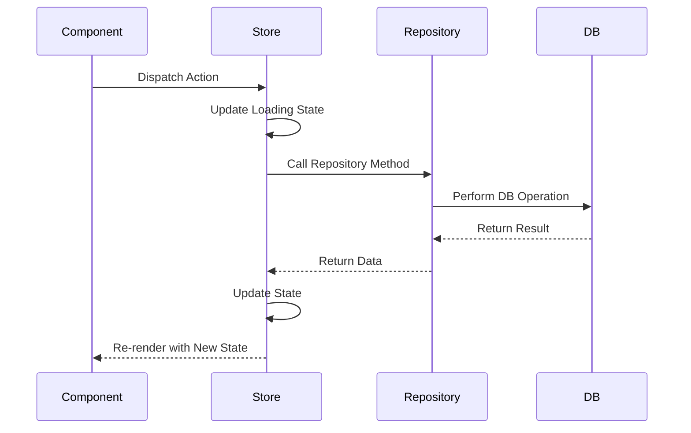

# State Management with Zustand

## Overview

This document describes the state management approach for the Preventa application using Zustand. It outlines the store structure, patterns, and best practices to maintain a consistent and predictable state throughout the application.

## Why Zustand

Zustand was chosen for state management in the Preventa application for several reasons:

1. **Simplicity**: Minimal boilerplate compared to Redux
2. **TypeScript Integration**: Strong typing support
3. **Middleware Support**: Built-in support for middleware like immer and persist
4. **Performance**: Automatic memoization and selective re-rendering
5. **Flexible API**: Supports various patterns (hooks, actions, selectors)

## Store Architecture

### Store Organization

The application uses a domain-based store organization with separate stores for each entity type:

```
src/stores/
├── useClienteStore.ts
├── useProductoStore.ts
├── useTarifaStore.ts
├── usePedidoStore.ts
└── useSyncStore.ts
```

### Store Structure Pattern

Each store follows a consistent structure:

```typescript
// Example: useClienteStore.ts
import create from 'zustand';
import { persist } from 'zustand/middleware';
import { ICliente } from '../models/clienteModels';
import { clienteRepository } from '../repositories/implementations/clienteRepository';

type ClienteState = {
  // State properties
  clientes: ICliente[];
  loading: boolean;
  error: string | null;
  selectedCliente: ICliente | null;
  
  // Actions
  fetchClientes: () => Promise<void>;
  getClienteById: (id: string) => Promise<ICliente | null>;
  createCliente: (cliente: Omit<ICliente, 'RecordIdent' | 'RecordVersion'>) => Promise<ICliente>;
  updateCliente: (cliente: ICliente) => Promise<ICliente>;
  deleteCliente: (id: string) => Promise<void>;
  setSelectedCliente: (cliente: ICliente | null) => void;
  clearError: () => void;
};

export const useClienteStore = create<ClienteState>(
  persist(
    (set, get) => ({
      // Initial state
      clientes: [],
      loading: false,
      error: null,
      selectedCliente: null,
      
      // Actions
      fetchClientes: async () => {
        set({ loading: true, error: null });
        try {
          const clientes = await clienteRepository.findAll();
          set({ clientes, loading: false });
        } catch (error) {
          set({ error: error.message, loading: false });
        }
      },
      
      getClienteById: async (id) => {
        set({ loading: true, error: null });
        try {
          const cliente = await clienteRepository.findById(id);
          return cliente;
        } catch (error) {
          set({ error: error.message, loading: false });
          return null;
        } finally {
          set({ loading: false });
        }
      },
      
      createCliente: async (clienteData) => {
        set({ loading: true, error: null });
        try {
          const newCliente = await clienteRepository.create(clienteData);
          set((state) => ({
            clientes: [...state.clientes, newCliente],
            loading: false
          }));
          return newCliente;
        } catch (error) {
          set({ error: error.message, loading: false });
          throw error;
        }
      },
      
      updateCliente: async (cliente) => {
        set({ loading: true, error: null });
        try {
          const updatedCliente = await clienteRepository.update(cliente);
          set((state) => ({
            clientes: state.clientes.map(c => 
              c.RecordIdent === updatedCliente.RecordIdent ? updatedCliente : c
            ),
            loading: false
          }));
          return updatedCliente;
        } catch (error) {
          set({ error: error.message, loading: false });
          throw error;
        }
      },
      
      deleteCliente: async (id) => {
        set({ loading: true, error: null });
        try {
          await clienteRepository.delete(id);
          set((state) => ({
            clientes: state.clientes.filter(c => c.RecordIdent !== id),
            loading: false
          }));
        } catch (error) {
          set({ error: error.message, loading: false });
          throw error;
        }
      },
      
      setSelectedCliente: (cliente) => {
        set({ selectedCliente: cliente });
      },
      
      clearError: () => {
        set({ error: null });
      }
    }),
    {
      name: 'cliente-storage',
      getStorage: () => localStorage
    }
  )
);
```

## State Flow Diagrams

### Basic State Flow



### CRUD Operations Flow

```mermaid
graph TD
    subgraph "Create Flow"
        C1[Component] -->|"createEntity(data)"| C2[Store]
        C2 -->|"create(data)"| C3[Repository]
        C3 -->|"add(data)"| C4[IndexedDB]
        C4 -->|"Return New Entity"| C3
        C3 -->|"Return New Entity"| C2
        C2 -->|"Update State"| C1
    end
    
    subgraph "Read Flow"
        R1[Component] -->|"fetchEntities()"| R2[Store]
        R2 -->|"findAll()"| R3[Repository]
        R3 -->|"getAll()"| R4[IndexedDB]
        R4 -->|"Return Entities"| R3
        R3 -->|"Return Entities"| R2
        R2 -->|"Update State"| R1
    end
    
    subgraph "Update Flow"
        U1[Component] -->|"updateEntity(entity)"| U2[Store]
        U2 -->|"update(entity)"| U3[Repository]
        U3 -->|"put(entity)"| U4[IndexedDB]
        U4 -->|"Return Updated Entity"| U3
        U3 -->|"Return Updated Entity"| U2
        U2 -->|"Update State"| U1
    end
    
    subgraph "Delete Flow"
        D1[Component] -->|"deleteEntity(id)"| D2[Store]
        D2 -->|"delete(id)"| D3[Repository]
        D3 -->|"remove(id)"| D4[IndexedDB]
        D4 -->|"Confirm Deletion"| D3
        D3 -->|"Confirm Deletion"| D2
        D2 -->|"Update State"| D1
    end
```



## Best Practices

### Store Access Patterns

1. **Direct State Access**

```typescript
// Access the entire state
const state = useClienteStore();

// In component render
return (
  <div>
    {state.loading ? (
      <LoadingSpinner />
    ) : (
      <ul>
        {state.clientes.map(cliente => (
          <li key={cliente.RecordIdent}>{cliente.Descripcion}</li>
        ))}
      </ul>
    )}
  </div>
);
```

2. **Selective State Access (Recommended)**

```typescript
// Access only what you need
const { clientes, loading } = useClienteStore(state => ({
  clientes: state.clientes,
  loading: state.loading
}));

// In component render
return (
  <div>
    {loading ? (
      <LoadingSpinner />
    ) : (
      <ul>
        {clientes.map(cliente => (
          <li key={cliente.RecordIdent}>{cliente.Descripcion}</li>
        ))}
      </ul>
    )}
  </div>
);
```

3. **Action-Only Access**

```typescript
// Access only actions
const { createCliente } = useClienteStore(state => ({
  createCliente: state.createCliente
}));

// In event handler
const handleSubmit = async (data) => {
  try {
    await createCliente(data);
    // Handle success
  } catch (error) {
    // Handle error
  }
};
```

### State Update Patterns

1. **Immutable Updates with Spread Operator**

```typescript
set((state) => ({
  clientes: [...state.clientes, newCliente]
}));
```

2. **Immutable Updates with Map/Filter**

```typescript
set((state) => ({
  clientes: state.clientes.map(c => 
    c.RecordIdent === updatedCliente.RecordIdent ? updatedCliente : c
  )
}));
```

3. **Using Immer for Complex Updates (Optional)**

```typescript
import { immer } from 'zustand/middleware';

export const useComplexStore = create(
  immer((set) => ({
    nested: { structure: { value: 0 } },
    updateNested: (newValue) => 
      set((state) => {
        state.nested.structure.value = newValue;
      })
  }))
);
```

## Persistence

The Preventa application uses Zustand's persist middleware to cache state in localStorage, improving load times and enabling some offline functionality.

```typescript
import { persist } from 'zustand/middleware';

export const usePersistedStore = create(
  persist(
    (set, get) => ({
      // Store implementation
    }),
    {
      name: 'store-name', // Unique name for storage key
      getStorage: () => localStorage, // Default is localStorage
      partialize: (state) => ({ 
        // Only persist certain parts of the state
        entities: state.entities 
      }),
    }
  )
);
```

## Middleware Integration

### Logging Middleware (Development)

```typescript
const log = (config) => (set, get, api) => config(
  (...args) => {
    console.log('Applying state changes:', args);
    set(...args);
    console.log('New state:', get());
  },
  get,
  api
);

const useStore = create(
  process.env.NODE_ENV === 'development'
    ? log((set, get) => ({
        // Store implementation
      }))
    : (set, get) => ({
        // Store implementation
      })
);
```

### Combined Middleware

```typescript
const useStore = create(
  persist(
    immer(
      log(
        (set, get) => ({
          // Store implementation
        })
      )
    ),
    {
      name: 'store-name',
      getStorage: () => localStorage
    }
  )
);
```

## Cross-Store Communication

### Direct Store Access

```typescript
// In usePedidoStore.ts
createPedido: async (pedidoData) => {
  // Access another store directly
  const cliente = useClienteStore.getState().clientes
    .find(c => c.RecordIdent === pedidoData.IDcliente);
    
  if (!cliente) {
    set({ error: 'Cliente no encontrado' });
    return;
  }
  
  // Continue with pedido creation
}
```

### Using Store Subscriptions

```typescript
// In a component that needs to react to changes in multiple stores
useEffect(() => {
  // Subscribe to cliente store changes
  const unsubscribeCliente = useClienteStore.subscribe(
    (state) => state.selectedCliente,
    (selectedCliente) => {
      if (selectedCliente) {
        // Do something when selected cliente changes
      }
    }
  );
  
  // Subscribe to tarifa store changes
  const unsubscribeTarifa = useTarifaStore.subscribe(
    (state) => state.tarifas,
    (tarifas) => {
      // Do something when tarifas change
    }
  );
  
  // Cleanup subscriptions
  return () => {
    unsubscribeCliente();
    unsubscribeTarifa();
  };
}, []);
```

## Testing Stores

### Unit Testing a Store

```typescript
// clienteStore.test.ts
import { useClienteStore } from './useClienteStore';
import { clienteRepository } from '../repositories/implementations/clienteRepository';

// Mock the repository
jest.mock('../repositories/implementations/clienteRepository');

describe('Cliente Store', () => {
  beforeEach(() => {
    // Clear the store before each test
    useClienteStore.setState({
      clientes: [],
      loading: false,
      error: null,
      selectedCliente: null
    });
    
    // Reset mocks
    jest.clearAllMocks();
  });
  
  test('fetchClientes should update state with fetched clientes', async () => {
    // Arrange
    const mockClientes = [{ RecordIdent: '1', Descripcion: 'Test Cliente' }];
    clienteRepository.findAll.mockResolvedValue(mockClientes);
    
    // Act
    await useClienteStore.getState().fetchClientes();
    
    // Assert
    expect(clienteRepository.findAll).toHaveBeenCalled();
    expect(useClienteStore.getState().clientes).toEqual(mockClientes);
    expect(useClienteStore.getState().loading).toBe(false);
  });
  
  test('fetchClientes should handle errors', async () => {
    // Arrange
    const errorMessage = 'Failed to fetch';
    clienteRepository.findAll.mockRejectedValue(new Error(errorMessage));
    
    // Act
    await useClienteStore.getState().fetchClientes();
    
    // Assert
    expect(clienteRepository.findAll).toHaveBeenCalled();
    expect(useClienteStore.getState().error).toBe(errorMessage);
    expect(useClienteStore.getState().loading).toBe(false);
  });
});
```

### Testing Components That Use Stores

```typescript
// ClientesList.test.tsx
import { render, screen, waitFor } from '@testing-library/react';
import { ClientesList } from './ClientesList';
import { useClienteStore } from '../stores/useClienteStore';

// Mock the store
jest.mock('../stores/useClienteStore');

describe('ClientesList Component', () => {
  test('renders loading state initially', () => {
    // Arrange
    useClienteStore.mockImplementation(() => ({
      clientes: [],
      loading: true,
      error: null,
      fetchClientes: jest.fn()
    }));
    
    // Act
    render(<ClientesList />);
    
    // Assert
    expect(screen.getByTestId('loading-spinner')).toBeInTheDocument();
  });
  
  test('renders clientes when loaded', async () => {
    // Arrange
    const mockClientes = [
      { RecordIdent: '1', Descripcion: 'Cliente 1' },
      { RecordIdent: '2', Descripcion: 'Cliente 2' }
    ];
    
    useClienteStore.mockImplementation(() => ({
      clientes: mockClientes,
      loading: false,
      error: null,
      fetchClientes: jest.fn()
    }));
    
    // Act
    render(<ClientesList />);
    
    // Assert
    expect(screen.getByText('Cliente 1')).toBeInTheDocument();
    expect(screen.getByText('Cliente 2')).toBeInTheDocument();
  });
});
```

## Performance Optimization

### Selective Re-rendering

To minimize re-renders, always select only the state you need:

```typescript
// Bad - component will re-render on ANY state change
const state = useStore();

// Good - component will only re-render when these specific values change
const { value1, value2 } = useStore(state => ({
  value1: state.value1,
  value2: state.value2
}));
```

### Memoization with useCallback and useMemo

```typescript
const Component = () => {
  // Only re-create this function when dependencies change
  const handleClick = useCallback(() => {
    const { updateValue } = useStore.getState();
    updateValue(newValue);
  }, [newValue]);
  
  // Only re-compute when dependencies change
  const filteredItems = useMemo(() => {
    const { items } = useStore.getState();
    return items.filter(item => item.active);
  }, [useStore.getState().items]);
  
  return (
    <div>
      <button onClick={handleClick}>Update</button>
      <ItemList items={filteredItems} />
    </div>
  );
};
```

## Troubleshooting

### Common Issues and Solutions

1. **State Updates Not Reflecting in UI**
   - Ensure you're using the correct selector pattern
   - Check that you're updating state immutably
   - Verify component is subscribed to the right state slice

2. **Performance Issues**
   - Use more granular selectors to prevent unnecessary re-renders
   - Profile component re-renders using React DevTools
   - Consider using memoization with useCallback/useMemo

3. **Persistence Issues**
   - Check browser storage limits
   - Verify persist configuration is correct
   - Use partialize to store only necessary state

## Conclusion

This document provides a comprehensive guide to state management in the Preventa application using Zustand. By following these patterns and best practices, developers can create a consistent, maintainable, and performant state management layer that supports the application's offline-first architecture.
