# Offline Synchronization Process

## Overview

This document details the complete synchronization process for the Preventa application, including workflows, conflict resolution procedures, and error handling guidelines. It expands on the basic synchronization fields defined in `generic/data-synchronization.md`.

## Synchronization Workflow

### 1. Initialization Phase

```mermaid
sequenceDiagram
    participant App as Application
    participant SyncManager as Sync Manager
    participant LocalDB as Local Database
    participant API as Server API
    
    App->>SyncManager: Initiate Sync
    SyncManager->>LocalDB: Identify Pending Changes
    LocalDB-->>SyncManager: Return Records (SyncStatus ≠ "synced")
    SyncManager->>SyncManager: Group by Entity Type
    SyncManager->>API: Request Server Timestamp
    API-->>SyncManager: Current Server Time
    SyncManager->>SyncManager: Begin Transaction
```



### 2. Upload Phase


### 3. Download Phase


### 4. Completion Phase


## Conflict Resolution

### Detection Mechanism

Conflicts are detected when:

1. **Same Record Modified**: Both local and server versions of a record have been modified (comparing `LocalModifiedDate` and `ServerModifiedDate`).
2. **Deletion Conflict**: Record was deleted on one side but modified on the other.
3. **Creation Conflict**: Record with same natural key created on both sides independently.

### Resolution Strategies

1. **Automatic Resolution**

   Based on the `ConflictResolution` field, conflicts can be automatically resolved:

   - `local_wins`: Local changes override server changes
   - `server_wins`: Server changes override local changes
   - `manual`: Requires user intervention

2. **Field-Level Resolution**

   For `manual` resolution, the system identifies conflicts at the field level:

   ```typescript
   interface ConflictDetail {
     entityType: string;           // E.g., "Cliente", "Producto"
     recordId: string;             // Record identifier
     fieldName: string;            // Field with conflict
     localValue: any;              // Current local value
     serverValue: any;             // Incoming server value
     resolution: "local" | "server" | null;  // Resolution choice
   }
   ```

3. **Resolution Workflow**

   ```mermaid
   sequenceDiagram
       participant User
       participant ConflictUI as Conflict Resolution UI
       participant SyncManager as Sync Manager
       participant LocalDB as Local Database
       participant API as Server API
       
       SyncManager->>ConflictUI: Present Conflicts
       ConflictUI->>User: Display Conflicting Fields
       User->>ConflictUI: Select Resolution for Each Field
       ConflictUI->>SyncManager: Submit Resolutions
       SyncManager->>LocalDB: Apply Local Resolutions
       SyncManager->>API: Send Resolved Conflicts
       API-->>SyncManager: Confirmation
       SyncManager->>ConflictUI: Update Resolution Status
   ```

## Error Handling

### Network Errors

1. **Connection Failures**
   - Automatic retry with exponential backoff (3 attempts)
   - Transaction rollback if all retries fail
   - Error state persisted to allow resuming sync later

2. **Partial Sync Completion**
   - Separate tracking for upload and download phases
   - Ability to resume from last successful operation
   - Partial success reporting to user

### Data Validation Errors

1. **Server Rejection of Data**
   - Invalid data rejection handled by adding `SyncError` field to record
   - Details of validation failure stored for user correction
   - Valid records proceed with synchronization

2. **Schema Mismatch**
   - Version checking before sync begins
   - Migration process triggered if schema update required
   - Sync aborted if incompatible versions detected

### Recovery Procedures

1. **Database Integrity Check**
   - Pre-sync validation of local database integrity
   - Automatic repair of minor inconsistencies
   - User notification for major integrity issues

2. **Sync History**
   - Maintenance of sync log with timestamps and results
   - Option to view sync history and error details
   - Manual sync reset capability for administrators

## Implementation Example

### Sync Manager Implementation

```typescript
// SyncManager.ts
import { SyncStatus, ConflictResolution } from '../models/syncTypes';
import { ApiService } from '../services/apiService';
import { DatabaseService } from '../services/databaseService';
import { ConflictManager } from './conflictManager';

export class SyncManager {
  private apiService: ApiService;
  private dbService: DatabaseService;
  private conflictManager: ConflictManager;
  
  constructor() {
    this.apiService = new ApiService();
    this.dbService = new DatabaseService();
    this.conflictManager = new ConflictManager();
  }
  
  async synchronize(): Promise<SyncResult> {
    try {
      // Step 1: Initialization
      const pendingChanges = await this.dbService.getPendingChanges();
      const serverTime = await this.apiService.getServerTime();
      
      // Begin transaction
      await this.dbService.beginTransaction();
      
      // Step 2: Upload Phase
      const createResults = await this.uploadCreatedRecords(pendingChanges.created);
      const updateResults = await this.uploadUpdatedRecords(pendingChanges.updated);
      const deleteResults = await this.uploadDeletedRecords(pendingChanges.deleted);
      
      // Step 3: Download Phase
      const lastSyncDate = await this.dbService.getLastSyncDate();
      const serverChanges = await this.apiService.getChangesSince(lastSyncDate);
      
      // Check for conflicts
      const conflicts = this.conflictManager.detectConflicts(
        pendingChanges, 
        serverChanges
      );
      
      // Resolve or store conflicts
      if (conflicts.length > 0) {
        await this.handleConflicts(conflicts);
      }
      
      // Apply non-conflicting server changes
      await this.applyServerChanges(serverChanges, conflicts);
      
      // Update sync status and timestamps
      await this.dbService.updateSyncStatus({
        processedRecords: [...createResults, ...updateResults, ...deleteResults],
        serverTime
      });
      
      // Commit transaction
      await this.dbService.commitTransaction();
      
      // Step 4: Completion
      return this.generateSyncReport({
        createResults,
        updateResults,
        deleteResults,
        conflicts
      });
    } catch (error) {
      // Rollback on error
      await this.dbService.rollbackTransaction();
      return {
        success: false,
        error: error.message,
        timestamp: new Date().toISOString()
      };
    }
  }
  
  // Implementation details of other methods omitted for brevity
}
```

### Conflict Resolution Component

```tsx
// ConflictResolutionDialog.tsx
import React, { useState } from 'react';
import { 
  Dialog, DialogTitle, DialogContent, DialogActions,
  Button, List, ListItem, Radio, RadioGroup, FormControlLabel
} from '@mui/material';
import { ConflictDetail } from '../models/syncTypes';

interface ConflictResolutionDialogProps {
  conflicts: ConflictDetail[];
  onResolve: (resolutions: ConflictDetail[]) => void;
  onCancel: () => void;
}

export const ConflictResolutionDialog: React.FC<ConflictResolutionDialogProps> = ({
  conflicts,
  onResolve,
  onCancel
}) => {
  const [resolutions, setResolutions] = useState<ConflictDetail[]>(conflicts);
  
  const handleResolutionChange = (index: number, value: 'local' | 'server') => {
    const updatedResolutions = [...resolutions];
    updatedResolutions[index].resolution = value;
    setResolutions(updatedResolutions);
  };
  
  const handleResolveAll = (value: 'local' | 'server') => {
    const updatedResolutions = resolutions.map(conflict => ({
      ...conflict,
      resolution: value
    }));
    setResolutions(updatedResolutions);
  };
  
  return (
    <Dialog open={conflicts.length > 0} maxWidth="md" fullWidth>
      <DialogTitle>Resolve Synchronization Conflicts</DialogTitle>
      <DialogContent>
        <div style={{ marginBottom: 16 }}>
          <Button onClick={() => handleResolveAll('local')} variant="outlined" sx={{ mr: 1 }}>
            Use All Local Values
          </Button>
          <Button onClick={() => handleResolveAll('server')} variant="outlined">
            Use All Server Values
          </Button>
        </div>
        
        <List>
          {resolutions.map((conflict, index) => (
            <ListItem key={`${conflict.entityType}-${conflict.recordId}-${conflict.fieldName}`} divider>
              <div style={{ width: '100%' }}>
                <div><strong>{conflict.entityType}</strong> - Field: {conflict.fieldName}</div>
                <div style={{ display: 'flex', justifyContent: 'space-between', marginTop: 8 }}>
                  <div>
                    <div><strong>Local Value:</strong></div>
                    <div>{JSON.stringify(conflict.localValue)}</div>
                  </div>
                  <div>
                    <div><strong>Server Value:</strong></div>
                    <div>{JSON.stringify(conflict.serverValue)}</div>
                  </div>
                </div>
                <RadioGroup
                  row
                  value={conflict.resolution || ''}
                  onChange={(e) => handleResolutionChange(index, e.target.value as 'local' | 'server')}
                >
                  <FormControlLabel value="local" control={<Radio />} label="Use Local" />
                  <FormControlLabel value="server" control={<Radio />} label="Use Server" />
                </RadioGroup>
              </div>
            </ListItem>
          ))}
        </List>
      </DialogContent>
      <DialogActions>
        <Button onClick={onCancel} color="secondary">
          Cancel
        </Button>
        <Button 
          onClick={() => onResolve(resolutions)} 
          color="primary"
          disabled={resolutions.some(r => r.resolution === null)}
        >
          Apply Resolutions
        </Button>
      </DialogActions>
    </Dialog>
  );
};
```

## Synchronization Testing

### Test Scenarios

1. **Normal Synchronization**
   - All local changes successfully sent to server
   - All server changes successfully applied locally
   - No conflicts or errors

2. **Conflict Scenarios**
   - Same record modified both locally and on server
   - Record deleted locally but modified on server
   - Record deleted on server but modified locally
   - Duplicate record created with same natural key

3. **Error Scenarios**
   - Network disconnect during sync
   - Server validation errors
   - Database corruption
   - Insufficient storage space

### Automated Testing

```typescript
// Example test for conflict resolution
describe('Synchronization Conflict Resolution', () => {
  beforeEach(async () => {
    // Setup test database with known state
    await setupTestDatabase();
  });
  
  test('should correctly resolve local_wins conflict strategy', async () => {
    // Setup: Create conflict scenario
    const localRecord = { id: '123', name: 'Local Name', syncStatus: 'pending_update' };
    const serverRecord = { id: '123', name: 'Server Name' };
    
    await db.clientes.put(localRecord);
    
    // Execute: Run sync with mocked server response
    const syncManager = new SyncManager();
    const mockApi = new MockApiService([serverRecord]);
    syncManager.setApiService(mockApi);
    
    // Configure conflict resolution strategy
    await db.conflictSettings.put({ entityType: 'clientes', strategy: 'local_wins' });
    
    // Run sync
    const result = await syncManager.synchronize();
    
    // Verify: Local record should be preserved
    const resolvedRecord = await db.clientes.get('123');
    expect(resolvedRecord.name).toBe('Local Name');
    expect(resolvedRecord.syncStatus).toBe('synced');
    expect(result.conflicts).toHaveLength(1);
    expect(result.conflicts[0].resolution).toBe('local_wins');
  });
});
```

## Performance Considerations

### Optimization Strategies

1. **Batched Processing**
   - Process records in batches of 100-500 records
   - Implement parallel processing for independent entities
   - Use WebWorkers for CPU-intensive operations

2. **Selective Synchronization**
   - Allow entity-specific sync (e.g., only sync orders)
   - Implement priority-based sync for critical data
   - Support partial sync resumption

3. **Data Compression**
   - Compress large data sets before transmission
   - Implement delta sync (only changed fields)
   - Use binary formats for large payloads

## Security Considerations

1. **Data Protection**
   - Encrypt sensitive data in IndexedDB
   - Implement HTTPS for all API communications
   - Apply JWT token validation

2. **Authorization**
   - Enforce server-side permissions during sync
   - Validate sync attempts against user roles
   - Prevent unauthorized data access via sync

## Conclusion

The synchronization system in the Preventa application provides robust offline capabilities with sophisticated conflict detection and resolution. By following the workflows and error handling procedures outlined in this document, developers can ensure reliable data synchronization between the client application and the server.
