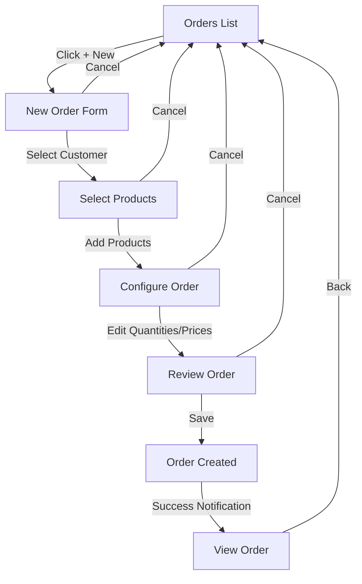
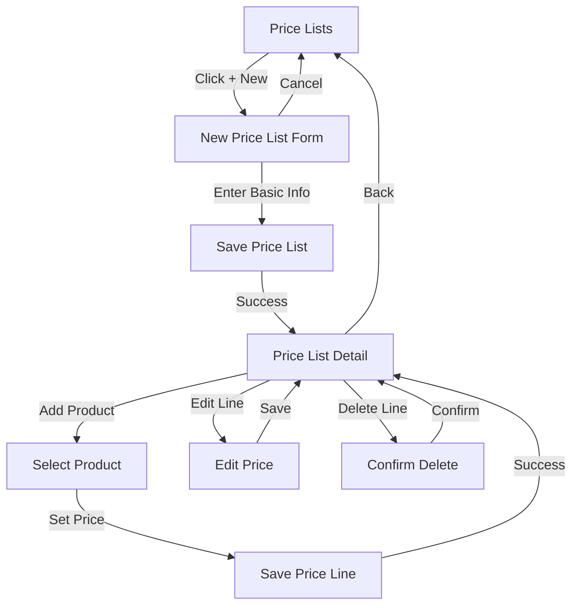

# UI Component Specifications

## Overview

This document provides detailed specifications for UI components in the Preventa application, including wireframes, usage guidelines, and implementation details.

## Design System

The Preventa application follows Material Design principles with a custom theme. All components should adhere to this design system for consistency.

### Color Palette

```
Primary: #1976d2 (Blue)
Secondary: #f50057 (Pink)
Error: #f44336 (Red)
Warning: #ff9800 (Orange)
Info: #2196f3 (Light Blue)
Success: #4caf50 (Green)

Background: #f5f5f5 (Light Grey)
Paper: #ffffff (White)
Text Primary: #212121 (Dark Grey)
Text Secondary: #757575 (Medium Grey)
```

### Typography

```
Headline: Roboto, 24px, Medium (500)
Subtitle: Roboto, 16px, Medium (500)
Body: Roboto, 14px, Regular (400)
Button: Roboto, 14px, Medium (500), uppercase
Caption: Roboto, 12px, Regular (400)
```

## Core Page Templates

### Entity List Page

Standard template for listing entities (Clientes, Productos, Tarifas, Pedidos).

#### Wireframe

```
┌──────────────────────────────────────────────────────┐
│ AppBar                                         🔍 ≡ │
├──────────────────────────────────────────────────────┤
│ [Page Title]                   [+ New] [Filter ▼]   │
├──────────────────────────────────────────────────────┤
│ ┌─────────────────────────────────────────────────┐  │
│ │ Filter Panel (expandable)                       │  │
│ └─────────────────────────────────────────────────┘  │
├──────────────────────────────────────────────────────┤
│ ┌─────┬───────────────┬────────────┬───────────────┐ │
│ │     │ Column 1      │ Column 2   │ Column 3      │ │
│ ├─────┼───────────────┼────────────┼───────────────┤ │
│ │ ☐   │ Item 1        │ Value 1    │ •••           │ │
│ ├─────┼───────────────┼────────────┼───────────────┤ │
│ │ ☐   │ Item 2        │ Value 2    │ •••           │ │
│ ├─────┼───────────────┼────────────┼───────────────┤ │
│ │ ☐   │ Item 3        │ Value 3    │ •••           │ │
│ ├─────┼───────────────┼────────────┼───────────────┤ │
│ │ ☐   │ Item 4        │ Value 4    │ •••           │ │
│ └─────┴───────────────┴────────────┴───────────────┘ │
│                                                      │
│ ┌─────────────────────────────────────────────────┐  │
│ │ Pagination: [◀ 1 2 3 ... ▶] [10 ▼] per page     │  │
│ └─────────────────────────────────────────────────┘  │
└──────────────────────────────────────────────────────┘
```

#### Behavior

- Clicking on a row opens the detail dialog
- Clicking the "+ New" button opens the entity creation dialog
- Filter panel expands/collapses when the Filter button is clicked
- Clicking on column headers sorts the list
- Checkboxes allow multiple selection for batch operations
- "•••" provides a menu with actions (Edit, Delete, etc.)

### Entity Detail Dialog

Standard modal dialog for viewing entity details.

#### Wireframe

```
┌──────────────────────────────────────────────────────┐
│ [Entity Type] - [Entity Name]                  [X]   │
├──────────────────────────────────────────────────────┤
│                                                      │
│  ┌────────────────┐ ┌────────────────────────────┐   │
│  │ Field 1:       │ │ Value 1                    │   │
│  └────────────────┘ └────────────────────────────┘   │
│                                                      │
│  ┌────────────────┐ ┌────────────────────────────┐   │
│  │ Field 2:       │ │ Value 2                    │   │
│  └────────────────┘ └────────────────────────────┘   │
│                                                      │
│  ┌────────────────┐ ┌────────────────────────────┐   │
│  │ Field 3:       │ │ Value 3                    │   │
│  └────────────────┘ └────────────────────────────┘   │
│                                                      │
│  ┌────────────────────────────────────────────────┐  │
│  │ Related Items Table (if applicable)            │  │
│  │                                                │  │
│  │                                                │  │
│  └────────────────────────────────────────────────┘  │
│                                                      │
├──────────────────────────────────────────────────────┤
│ [Delete]                        [Cancel] [Edit]      │
└──────────────────────────────────────────────────────┘
```

#### Behavior

- Dialog is modal (blocks interaction with the rest of the UI)
- Click outside or X button closes the dialog
- Edit button switches to edit mode
- Delete button shows a confirmation dialog before deletion
- Related items table shows associated records (e.g., order lines for an order)

### Entity Edit Dialog

Standard modal dialog for editing entity details.

#### Wireframe

```
┌──────────────────────────────────────────────────────┐
│ [Edit/New] [Entity Type]                       [X]   │
├──────────────────────────────────────────────────────┤
│                                                      │
│  ┌────────────────┐ ┌────────────────────────────┐   │
│  │ Field 1:       │ │ [Input Field]              │   │
│  └────────────────┘ └────────────────────────────┘   │
│                                                      │
│  ┌────────────────┐ ┌────────────────────────────┐   │
│  │ Field 2:       │ │ [Input Field]              │   │
│  └────────────────┘ └────────────────────────────┘   │
│                                                      │
│  ┌────────────────┐ ┌────────────────────────────┐   │
│  │ Field 3:       │ │ [Dropdown]                 ▼│   │
│  └────────────────┘ └────────────────────────────┘   │
│                                                      │
│  ┌────────────────────────────────────────────────┐  │
│  │ Related Items Editor (if applicable)           │  │
│  │ [+] [Item] [Value] [Delete]                    │  │
│  │                                                │  │
│  └────────────────────────────────────────────────┘  │
│                                                      │
├──────────────────────────────────────────────────────┤
│                                   [Cancel] [Save]    │
└──────────────────────────────────────────────────────┘
```

#### Behavior

- Required fields are marked with an asterisk (*)
- Field validation occurs on blur and on form submission
- Error messages appear below invalid fields
- Cancel button returns to view mode without saving changes
- Save button validates all fields before saving
- Related items editor allows adding/editing/removing related records

## Entity-Specific Components

### Pedidos Filter Component

Specialized filter component for the Orders list.

#### Wireframe

```
┌──────────────────────────────────────────────────────┐
│ Filtros de Pedidos                          [▲]      │
├──────────────────────────────────────────────────────┤
│ ┌────────────────┐ ┌────────────────┐ ┌────────────┐ │
│ │ Cliente      ▼ │ │ Fecha Desde  ▼ │ │ Fecha Hasta ▼│ │
│ └────────────────┘ └────────────────┘ └────────────┘ │
│                                                      │
│ ┌────────────────┐ ┌────────────────┐               │
│ │ Total Mínimo   │ │ Total Máximo   │               │
│ └────────────────┘ └────────────────┘               │
│                                                      │
│ [Limpiar Filtros]                        [Aplicar]   │
└──────────────────────────────────────────────────────┘
```

#### Behavior

- Cliente dropdown shows a searchable list of all active customers
- Date fields open a date picker when clicked
- Number fields validate for numeric input only
- "Limpiar Filtros" (Clear Filters) resets all filter fields
- "Aplicar" (Apply) button activates the filter with current values

### TarifasLineas Editor

Inline editor for price list lines within a Tarifa detail view.

#### Wireframe

```
┌──────────────────────────────────────────────────────┐
│ Líneas de Tarifa                       [+ Añadir]    │
├──────────────────┬───────────────────┬───────────────┤
│ Producto         │ Precio            │ Acciones      │
├──────────────────┼───────────────────┼───────────────┤
│ [Producto 1    ▼]│ [123.45        ]  │ [🗑️]          │
├──────────────────┼───────────────────┼───────────────┤
│ [Producto 2    ▼]│ [67.89         ]  │ [🗑️]          │
├──────────────────┼───────────────────┼───────────────┤
│ [Producto 3    ▼]│ [240.00        ]  │ [🗑️]          │
├──────────────────┼───────────────────┼───────────────┤
│ [Producto      ▼]│ [              ]  │ [🗑️]          │
└──────────────────┴───────────────────┴───────────────┘
```

#### Behavior

- Last row is always empty for adding new lines
- Producto dropdown filters out products that already have a price in this tarifa
- Precio field validates for numeric values only
- Changes are saved immediately on field blur
- Delete button (🗑️) removes the line after confirmation

### PedidosLineas Editor

Inline editor for order lines within a Pedido edit view.

#### Wireframe

```
┌──────────────────────────────────────────────────────────────────────────┐
│ Líneas de Pedido                                          [+ Añadir]     │
├──────────────┬───────────────┬───────────┬──────────┬────────┬───────────┤
│ Producto     │ Descripción   │ Cantidad  │ Precio   │ Total  │ Acciones  │
├──────────────┼───────────────┼───────────┼──────────┼────────┼───────────┤
│ [Prod. 1   ▼]│ Descripción 1 │ [2      ] │ [10.50 ] │ 21.00  │ [🗑️]      │
├──────────────┼───────────────┼───────────┼──────────┼────────┼───────────┤
│ [Prod. 2   ▼]│ Descripción 2 │ [1      ] │ [25.75 ] │ 25.75  │ [🗑️]      │
├──────────────┼───────────────┼───────────┼──────────┼────────┼───────────┤
│ [Prod.     ▼]│               │ [       ] │ [      ] │        │ [🗑️]      │
└──────────────┴───────────────┴───────────┴──────────┴────────┴───────────┘
```

#### Behavior

- Last row is always empty for adding new lines
- Producto dropdown shows all active products
- When a product is selected, its description and default price are auto-filled
- Price defaults to the customer's tarifa price if available
- Cantidad (Quantity) and Precio (Price) fields validate for numeric values
- Total is calculated automatically (Cantidad * Precio)
- Changes are saved immediately on field blur

## Mobile Adaptations

### Entity List (Mobile)

```
┌─────────────────────────┐
│ AppBar             ☰    │
├─────────────────────────┤
│ [Page Title]   [🔍] [↓] │
├─────────────────────────┤
│ ┌───────────────────┐   │
│ │ Item 1            │   │
│ │ Subtitle 1        │   │
│ └───────────────────┘   │
│ ┌───────────────────┐   │
│ │ Item 2            │   │
│ │ Subtitle 2        │   │
│ └───────────────────┘   │
│ ┌───────────────────┐   │
│ │ Item 3            │   │
│ │ Subtitle 3        │   │
│ └───────────────────┘   │
│                         │
│                         │
│                         │
└─────────────────────────┘
        [+]
```

#### Behavior

- List items are simplified to show only key information
- Clicking an item navigates to a full-screen detail view
- Floating action button [+] for creating new items
- Filter icon [🔍] opens the filter panel as a bottom sheet
- Sort icon [↓] opens sort options as a dropdown

### Entity Detail/Edit (Mobile)

```
┌─────────────────────────┐
│ ← [Entity Type]    ⋮    │
├─────────────────────────┤
│                         │
│ Field 1                 │
│ Value 1                 │
│                         │
│ Field 2                 │
│ Value 2                 │
│                         │
│ Field 3                 │
│ Value 3                 │
│                         │
│ Related Items           │
│ ┌───────────────────┐   │
│ │ Item 1            │   │
│ └───────────────────┘   │
│ ┌───────────────────┐   │
│ │ Item 2            │   │
│ └───────────────────┘   │
│                         │
└─────────────────────────┘
      [Edit]
```

#### Behavior

- Full-screen view instead of a dialog
- Back arrow (←) returns to the list view
- Options menu (⋮) for additional actions (Delete, Share, etc.)
- Edit button opens edit mode as a new screen
- Related items can be expanded/collapsed

## User Flow Diagrams

### Order Creation Flow



### Price List Management Flow



## Implementation Guidelines

### Component Structure

Components should follow this hierarchy:

1. **Page Components**: Top-level components that represent a full page
2. **Container Components**: Manage state and data flow
3. **Presentation Components**: Render UI based on props without internal state

Example:

```typescript
// Page Component
const ClientesPage: React.FC = () => {
  // Page-level state and logic
  return <ClientesContainer />;
};

// Container Component
const ClientesContainer: React.FC = () => {
  // Data fetching and state management
  const { clientes, loading, error } = useClienteStore(state => ({
    clientes: state.clientes,
    loading: state.loading,
    error: state.error
  }));
  
  return <ClientesList clientes={clientes} loading={loading} error={error} />;
};

// Presentation Component
interface ClientesListProps {
  clientes: ICliente[];
  loading: boolean;
  error: string | null;
}

const ClientesList: React.FC<ClientesListProps> = ({ clientes, loading, error }) => {
  // Pure rendering logic
  if (loading) return <LoadingIndicator />;
  if (error) return <ErrorMessage message={error} />;
  
  return (
    <div>
      {clientes.map(cliente => (
        <ClienteListItem key={cliente.RecordIdent} cliente={cliente} />
      ))}
    </div>
  );
};
```

### Responsive Design Guidelines

1. **Breakpoints**:
   - xs: 0-599px (mobile)
   - sm: 600-959px (tablet portrait)
   - md: 960-1279px (tablet landscape)
   - lg: 1280-1919px (desktop)
   - xl: 1920px+ (large desktop)

2. **Layout Rules**:
   - Use CSS Grid or Flexbox for layouts
   - Implement mobile-first approach
   - Use Material UI's Grid component for consistent spacing
   - Dialog components switch to full-screen on mobile

3. **Touch Targets**:
   - Minimum touch target size of 48x48px on mobile
   - Adequate spacing between interactive elements (min 8px)

## Accessibility Guidelines

1. **Keyboard Navigation**:
   - All interactive elements must be keyboard accessible
   - Logical tab order following visual layout
   - Focus indicators must be visible

2. **Screen Readers**:
   - All images require alt text
   - Form fields must have associated labels
   - Use aria-* attributes appropriately
   - Test with screen readers (NVDA, VoiceOver)

3. **Color and Contrast**:
   - Maintain minimum contrast ratio of 4.5:1 for normal text
   - Don't rely on color alone to convey information
   - Provide alternative indicators (icons, patterns)

## Animation Guidelines

1. **Purpose**:
   - Use animations purposefully to guide attention
   - Enhance the user's understanding of state changes
   - Keep animations subtle and not distracting

2. **Performance**:
   - Prefer CSS transitions and animations over JavaScript
   - Animate only transform and opacity properties when possible
   - Keep animations under 300ms for optimal responsiveness

3. **Accessibility**:
   - Honor user preferences for reduced motion
   - Provide non-animated alternatives
   - Ensure animations don't trigger vestibular disorders

## Component API Documentation

Each component should be documented using the following template:

```typescript
/**
 * ComponentName - Brief description
 *
 * Detailed description of the component's purpose and behavior.
 *
 * @example
 * // Basic usage
 * <ComponentName prop1="value" prop2={123} />
 *
 * // With optional features
 * <ComponentName
 *   prop1="value"
 *   optionalProp="optional value"
 *   onSomething={() => console.log('Event triggered')}
 * />
 */
interface ComponentNameProps {
  /**
   * Description of prop1
   */
  prop1: string;
  
  /**
   * Description of prop2
   */
  prop2: number;
  
  /**
   * Description of optionalProp
   * @default 'default value'
   */
  optionalProp?: string;
  
  /**
   * Callback when something happens
   */
  onSomething?: () => void;
}

export const ComponentName: React.FC<ComponentNameProps> = ({
  prop1,
  prop2,
  optionalProp = 'default value',
  onSomething
}) => {
  // Component implementation
};
```

## Conclusion

This UI component specification provides a comprehensive guide for implementing the Preventa application's user interface. By following these guidelines, developers can create a consistent, accessible, and user-friendly experience across all parts of the application.
