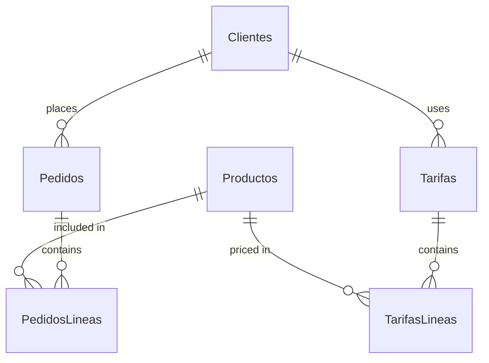

# Core Entities & Data Model

This section describes the main entities in the Preventa application, their fields, relationships, and key constraints. These rules are specific to the application and must be followed in both the UI and data layer.

## Main Entities

### Clientes (Customers)
- Fields: Codigo, Descripcion, Contacto, Telefono, Email, Web, IDtarifa, Inactivo
- Required: Codigo, Descripcion
- Unique: Codigo
- Cannot be deleted if has Pedidos (orders); UI must offer to transfer, delete, or cancel.

### Productos (Products)
- Fields: Codigo, Descripcion, Precio, IVA, Inactivo
- Required: All fields
- Unique: Codigo
- Cannot be deleted if used in Tarifas or Pedidos; UI must offer to remove from Tarifas or cancel.

### Tarifas (Pricing)
- Fields: Codigo, Descripcion, Inactivo
- Required: Codigo, Descripcion
- Unique: Codigo
- Cannot be deleted if in use by Clientes; UI must offer to transfer, clear, or cancel.
- Deleting a Tarifa deletes all its TarifasLineas.

### TarifasLineas
- Fields: IDtarifa, IDproducto, Precio
- Required: All fields
- Unique: (IDtarifa, IDproducto) pair

### Pedidos (Orders)
- Fields: Numero (autoincrement), IDcliente, FechaHora
- Required: Numero, IDcliente, FechaHora
- Deleting a Pedido deletes all its PedidosLineas.
- FechaHora is auto-generated and immutable after creation.

### PedidosLineas
- Fields: IDpedido, IDproducto, Cantidad, Precio, Observaciones
- Required: IDpedido, IDproducto, Cantidad, Precio

## Entity Relationships

- Clientes place Pedidos
- Clientes use Tarifas
- Productos are included in PedidosLineas and TarifasLineas
- Pedidos contain PedidosLineas
- Tarifas contain TarifasLineas

## Synchronization Fields

All tables include:
- RecordIdent (UUID, unique)
- RecordVersion (string)
- SyncStatus (enum: synced, pending_create, pending_update, pending_delete)
- LastSyncDate (timestamp, ISO 8601 UTC)
- LocalModifiedDate (timestamp)
- ServerModifiedDate (timestamp)
- ConflictResolution (optional: local_wins, server_wins, manual)

## Additional Constraints
- Referential integrity must be maintained when generating or deleting data.
- See [Validation & Business Rules](validation-business-rules.md) for field-level validation. 