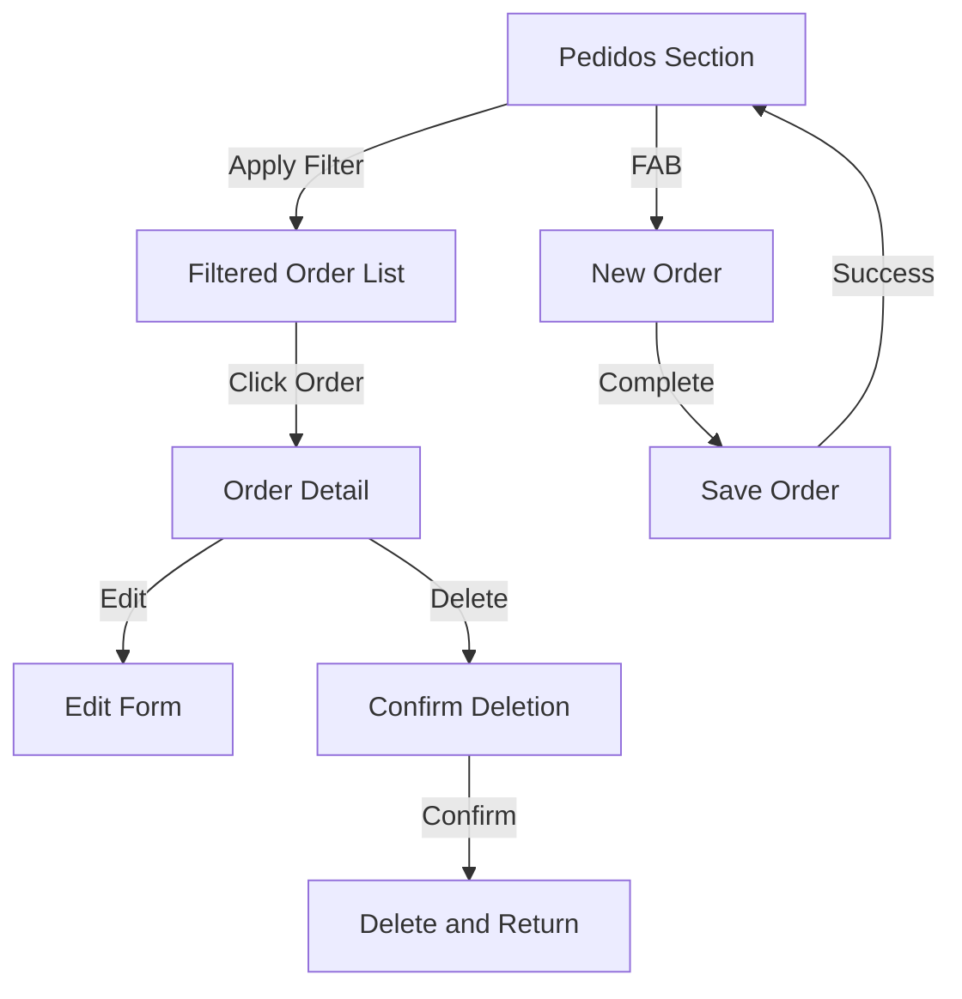

# Navigation & Interaction Flows

This section describes the navigation structure and main user interaction flows in the Preventa application.

## Main Navigation Structure
- Top bar: Section title, sync status indicator, overflow menu
- Bottom navigation: Tabs for Pedidos, Clientes, Productos, Tarifas (with icons and text)
- FAB: Contextual, present in all main sections
- Overflow menu: Sync, generate demo data, wipe data, about

## Main User Flows

### Pedidos (Orders)
- Initially empty; user must apply filters to see orders
- Filter panel: Cliente, date range, total range (all combinable)
- List: Click to view details; FAB to create new order
- Detail: View, edit, or delete order; see order lines
- Edit/Create: Modal (desktop) or full-screen (mobile); select client, add/edit lines, auto-calculate total

### Clientes (Customers)
- Search bar at top; list shows code, description, sync status
- FAB to create new client
- Detail: View, edit, or delete; see associated orders
- Edit/Create: Modal/full-screen; validate fields; assign optional tarifa

### Productos (Products)
- Search bar at top; list shows code, description, price, IVA
- FAB to create new product
- Detail: View, edit, or delete; see associated tarifas
- Edit/Create: Modal/full-screen; validate fields

### Tarifas (Pricing)
- Search bar at top; list shows code, description
- FAB to create new tarifa
- Detail: View, edit, or delete; editable grid of TarifasLineas
- On delete: If in use, offer to transfer, clear, or cancel

## Transversal Flows
- Sync: Indicator always visible; manual sync via menu; conflict dialog if needed
- Error/validation: Consistent feedback via snackbar, dialogs, and field errors

## Example: Pedidos Flow Diagram

See also: [UI & UX Patterns](ui-ux-patterns.md) for dialog and feedback rules. 